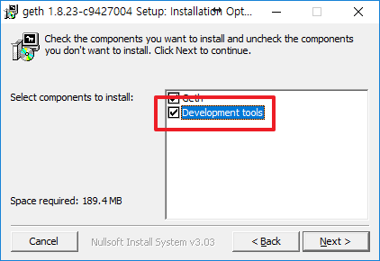
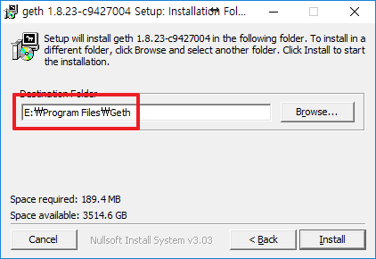

### Geth 설치하기
- [다운로드]()  
- Development tools는 설치해야함  
    
- 설치폴더 변경(기본폴더에 설치해도 됨^^)  
    
- 설치 후 확인  
  안되면 Path에 Geth 설치경로만 추가해주면 됨^^  
~~~
PS C:\Users\~> geth version
Geth
Version: 1.8.23-stable
Git Commit: c942700427557e3ff6de3aaf6b916e2f056c1ec2
Architecture: amd64
Protocol Versions: [63 62]
Network Id: 1
Go Version: go1.11.5
Operating System: windows
GOPATH=
GOROOT=C:\go
~~~
